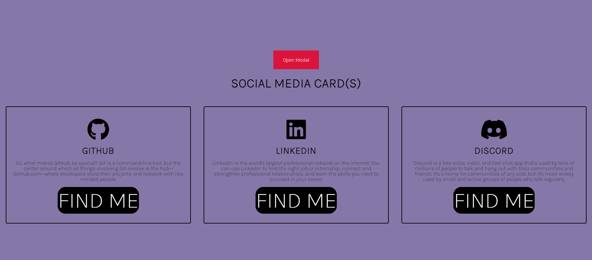
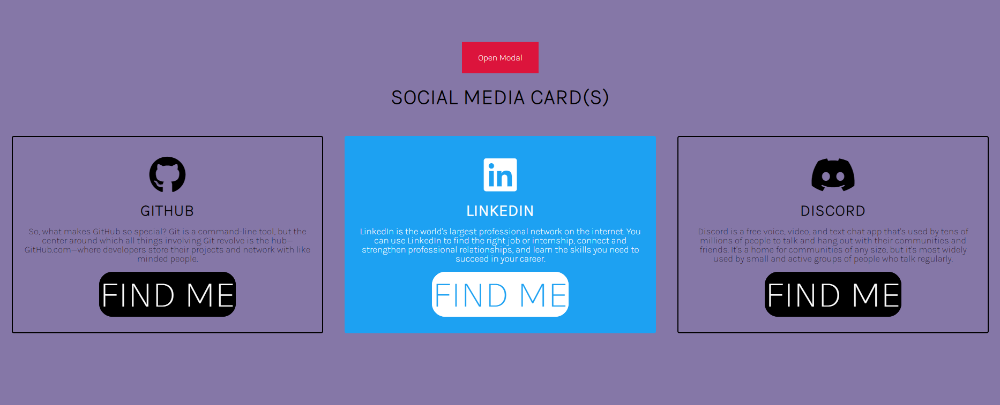
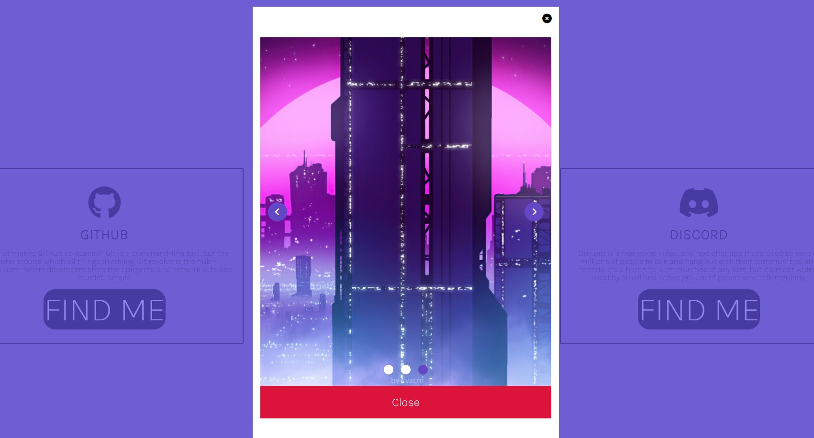

# Bem-vindo ao Modal Synthwave!

Olá! Esse desafio foi feito para uma proposta de emprego, dada esta razão, este README.md estará em **português**, objetivando a compreensão universal entre aqueles que irão ler e analisar a proposta do projeto e do código, também.

# Npm install & Npm run serve.

Para realizar a instalação de todas as dependências do projeto, basta executar o comando **npm install** em seu terminal!

E para que inicie o servidor do projeto, basta abrir um terminal, seja ele powershell ou git e inserir a linha de comando **npm run serve**, essa que está determinada no package.json para utilizar o serviço do vue-cli e servir os arquivos necessários.

## Acessando o localhost.

O passo seguinte se resume em acessar seu localhost na porta 8080, ou http://localhost:8080/ para os mais íntimos. Tome cuidado para que não tenha outro serviço rodando nesta porta pois isto pode causar problemas não esperados, embora raramente esta porta esteja sendo utilizada e por isso esta causa é difícil de ocorrer, mas de toda forma, fique atento!

## Synthwave? Mas a proposta do desafio foi enviada pelo link de acesso ao Figma!

Sim, é bem verdade que foi enviada a proposta. De toda forma, busquei adicionar o meu toque no projeto para que ele fique único uma vez que não vejo problema nisso, não obstante, todos os requisitos foram devidamente cumpridos, mesmo que adaptados ao meu trejeito.

## Vue 3!

Foi utilizado Vue 3 e composition API no projeto, buscando torná-lo o mais próximo possível da versão atual em que o framework se encontra.

## /carousel.

Caso queira ver todo o carrossel nos mais minuciosos detalhes, existe a URL /carousel para que você possa acessá-lo! Ele é completamente customizável e para isso basta passar as propriedades no componente utilizado na HomeView.vue ou Carousel.vue, sendo portanto completamente reutilizável.

## E falando em reutilização e componentização!

Todo o projeto foi feito com uma boa componentização em mente e portanto, uma boa possibilidade de reutilização, podendo até mesmo configurar e determinar as propriedades na inserção do componente pois slots foram utilizados como base para tornar cada componente único no seu uso!

# Mas como está o projeto? Segue algumas fotos abaixo!

<<<<<<< HEAD

=======

>>>>>>> f11ed01d4dd420a9873638e346520e85b436aebd
